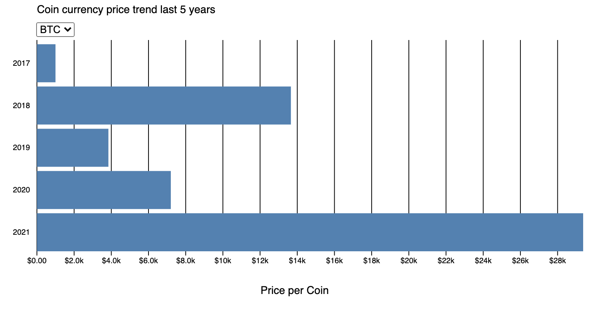

## Frontend data

This repo is dedicated to learning the D3.js library by making data visualizations.
The project consists of a barchart that visualizes the price snapshots of various cryptocurrencies over the course of 5 years.

Live link: [link](https://app.netlify.com/sites/fd-d3/overview)

The project is graded according to the following rubric: [Rubric](https://github.com/cmda-tt/course-21-22/blob/main/fd/assessment.md)

## Data

The following datasets are used:

-   [Cardano dataset](https://www.kaggle.com/sudalairajkumar/cryptocurrencypricehistory?select=coin_Cardano.csv)
-   [Bitcoin dataset](https://www.kaggle.com/sudalairajkumar/cryptocurrencypricehistory?select=coin_Bitcoin.csv)

Source: [Sudalairajkumar - Cryptocurrency Historical Prices](https://www.kaggle.com/sudalairajkumar)

## Installation

If you are using Visual Studio Code you can view the graph by opening it with Live Server

Navigate to desired directory and clone the repo

`git clone https://github.com/benl95/fp.git`

Open the repo and navigate to the views folder

`cd src/views`

Open the index.html file in Live Server

## Tech

-   D3 V7
-   Prettier

## license

MIT
